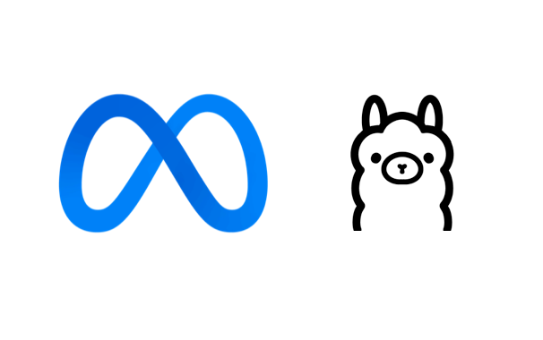
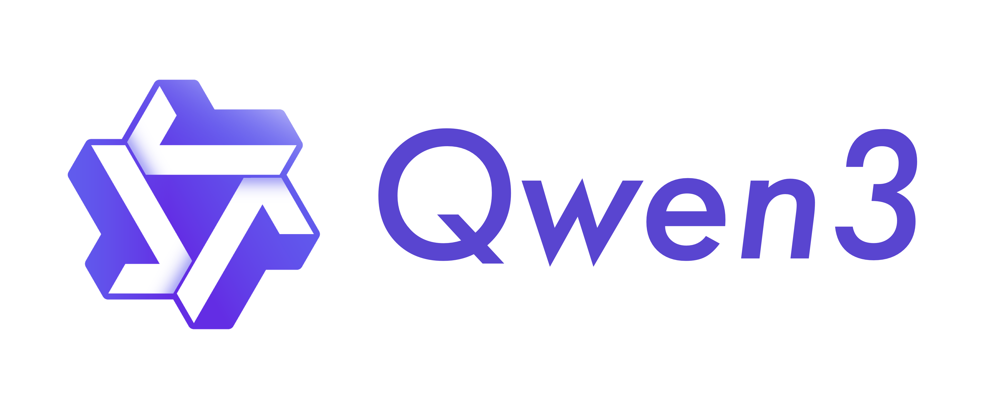
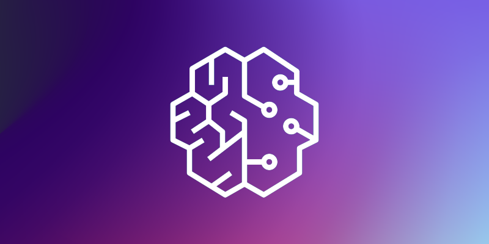

<!---
Copyright 2025 The HuggingFace Team. All rights reserved.

Licensed under the Apache License, Version 2.0 (the "License");
you may not use this file except in compliance with the License.
You may obtain a copy of the License at

    http://www.apache.org/licenses/LICENSE-2.0

Unless required by applicable law or agreed to in writing, software
distributed under the License is distributed on an "AS IS" BASIS,
WITHOUT WARRANTIES OR CONDITIONS OF ANY KIND, either express or implied.
See the License for the specific language governing permissions and
limitations under the License.
-->

# 🚀  Tutorials: How To Fine-tune & Run LLMs

Learn how to run and fine-tune models for optimal performance with AWS Trainium.

<a href="./sft_lora_finetune_llm" style="text-decoration: none !important; color: inherit !important; display: block !important;">

  

    🦙
'"/>
  

  

    <h3 style="margin: 0 0 8px 0 !important; font-size: 18px !important; font-weight: 600 !important; color: #24292e !important;">
      Llama 3
    </h3>
    

      Fine-tune Llama 3 8B with LoRA
    

  

</a>

<a href="./finetune_qwen3" style="text-decoration: none !important; color: inherit !important; display: block !important;">

  

    🔷
'"/>
  

  

    <h3 style="margin: 0 0 8px 0 !important; font-size: 18px !important; font-weight: 600 !important; color: #24292e !important;">
      Qwen 3
    </h3>
    

      Fine-tune Qwen3 8B with LoRA
    

  

</a>

<a href="./pretraining_hyperpod_llm" style="text-decoration: none !important; color: inherit !important; display: block !important;">

  

    ☁️ SageMaker
'"/>
  

  

    <h3 style="margin: 0 0 8px 0 !important; font-size: 18px !important; font-weight: 600 !important; color: #24292e !important;">
      Continuous Pretraining on SageMaker Hyperpod
    </h3>
    

      Continuous Pretrain Llama 3.2 1B on SageMaker Hyperpod
    

  

</a>

## What you'll learn

These tutorials will guide you through the complete process of fine-tuning large language models on AWS Trainium:

- **📊 Data Preparation**: Load and preprocess datasets for supervised fine-tuning
- **🔧 Model Configuration**: Set up LoRA adapters and distributed training parameters
- **⚡ Training Optimization**: Leverage tensor parallelism, gradient checkpointing, and mixed precision
- **💾 Checkpoint Management**: Consolidate and merge model checkpoints for deployment
- **🚀 Model Deployment**: Export and test your fine-tuned models for inference

Choose the tutorial that best fits your use case and start fine-tuning your LLMs on AWS Trainium today!
